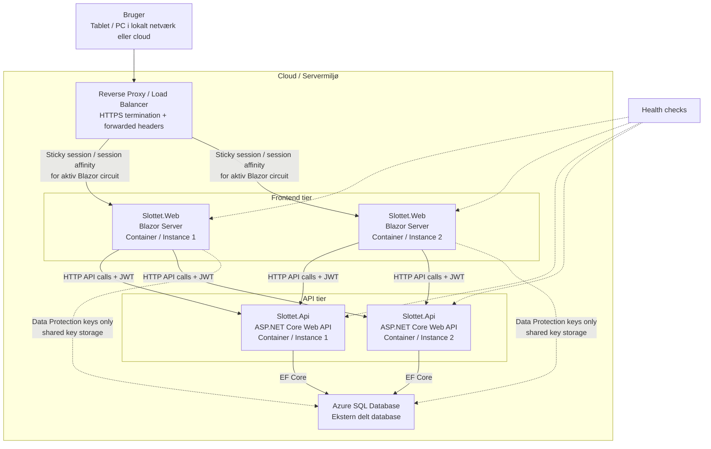

# Deployment Diagram

Dette diagram viser den nuværende deployment-arkitektur for Slottet og den produktionsretning, løsningen er designet til.

## Formål

Diagrammet skal vise:

- at løsningen er et distribueret client-server system
- at frontend og API er separate deploybare enheder
- at databasen er ekstern
- at løsningen kan køre både lokalt og i cloud
- at API er egnet til horisontal skalering
- at frontend med Blazor Server kræver sticky sessions/session affinity ved load balancing

## Mermaid-diagram

## Forklaring

### Frontend

- Frontenden er `Slottet.Web`
- den kører som Blazor Server
- den kan deployes i flere instanser
- den kommunikerer med API'et via HTTP
- den bruger JWT fra login-flowet til kald mod API'et

Relevante filer:

- `src/Slottet.Web/Program.cs`
- `src/Slottet.Web/Auth/AuthService.cs`
- `src/Slottet.Web/Auth/BrowserSessionAuthStore.cs`

### API

- API'et er `Slottet.Api`
- det eksponerer systemets funktioner som eksternt API
- det er den mest oplagte service at skalere horisontalt
- det bruger EF Core mod SQL Server

Relevante filer:

- `src/Slottet.Api/Program.cs`
- `src/Slottet.Api/Controllers`
- `src/Slottet.Infrastructure/Data/ApplicationDbContext.cs`

### Database

- databasen er ekstern Azure SQL
- den bruges til domænedata
- den bruges også til delte Data Protection keys
- Data Protection keys bruges kun som framework-infrastruktur i frontend og ikke til domænedata

Relevante filer:

- `src/Slottet.Infrastructure/Data/ApplicationDbContext.cs`
- `src/Slottet.Infrastructure/Data/Migrations/20260413120000_AddDataProtectionKeys.cs`

### Load balancer / reverse proxy

- i produktion antages løsningen at køre bag reverse proxy eller load balancer
- forwarded headers bruges for korrekt håndtering af klient-IP og HTTPS scheme
- Blazor Server kræver sticky sessions/session affinity for aktiv circuit

Relevante filer:

- `src/Slottet.Web/Program.cs`
- `src/Slottet.Api/Program.cs`
- `docker-compose.prod.yml`

### Health checks

- både frontend og API har `/health`
- health checks bruges til at afgøre om en service er klar og ikke kun startet

Relevante filer:

- `src/Slottet.Web/Program.cs`
- `src/Slottet.Api/Program.cs`
- `docker-compose.yml`

## Hvordan diagrammet kan forklares til eksamen

En mulig formulering:

“Deployment-diagrammet viser, at løsningen er et distribueret client-server system. Frontend og API er separate deploybare services, og databasen er ekstern i Azure SQL. API'et er velegnet til horisontal skalering, mens frontenden er Blazor Server og derfor kræver session affinity ved load balancing. Løsningen er derfor cloud-ready i sin arkitektur, men den konkrete højtilgængelighedsopsætning afhænger af den valgte platform, fx Azure.”

## Lokalt versus produktion

Lokalt i development:

- `docker-compose.yml` starter typisk én frontend og én API
- Swagger er aktiveret
- reverse proxy er ikke nødvendig

I produktionsretningen:

- flere instanser af API kan køre bag load balancer
- frontend kan også køres i flere instanser, men kræver sticky sessions
- Swagger er som udgangspunkt slået fra
- reverse proxy og forwarded headers er relevante
