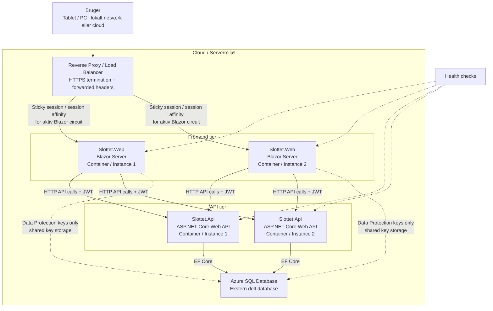

# Deployment Diagram

Dette diagram viser den nuværende deployment-arkitektur for Slottet og den produktionsretning, løsningen er designet til.

Forklarende tekst står i pdf filen i afleveringen af dette projekt.

## Mermaid-diagram

```mermaid
flowchart TB
    user["Bruger<br/>Tablet / PC i lokalt netværk eller cloud"] --> lb

    subgraph cloud["Cloud / Servermiljø"]
        lb["Reverse Proxy / Load Balancer<br/>HTTPS termination + forwarded headers"]

        subgraph webtier["Frontend tier"]
            web1["Slottet.Web<br/>Blazor Server<br/>Container / Instance 1"]
            web2["Slottet.Web<br/>Blazor Server<br/>Container / Instance 2"]
        end

        subgraph apitier["API tier"]
            api1["Slottet.Api<br/>ASP.NET Core Web API<br/>Container / Instance 1"]
            api2["Slottet.Api<br/>ASP.NET Core Web API<br/>Container / Instance 2"]
        end

        sql["Azure SQL Database<br/>Ekstern delt database"]
    end

    lb -->|"Sticky session / session affinity<br/>for aktiv Blazor circuit"| web1
    lb -->|"Sticky session / session affinity<br/>for aktiv Blazor circuit"| web2

    web1 -->|"HTTP API calls + JWT"| api1
    web1 -->|"HTTP API calls + JWT"| api2
    web2 -->|"HTTP API calls + JWT"| api1
    web2 -->|"HTTP API calls + JWT"| api2

    api1 -->|"EF Core"| sql
    api2 -->|"EF Core"| sql

    web1 -.->|"Data Protection keys only<br/>shared key storage"| sql
    web2 -.->|"Data Protection keys only<br/>shared key storage"| sql

    hc["Health checks"] -.-> web1
    hc -.-> web2
    hc -.-> api1
    hc -.-> api2
```

Deployment-diagrammet viser, hvordan systemet er tænkt placeret i et produktionsmiljø. Brugeren tilgår systemet gennem en browser på tablet eller PC, hvorefter trafikken går gennem en reverse proxy eller load balancer. Herfra sendes brugeren videre til frontend-laget, som består af en eller flere instanser af Slottet.Web. Frontenden kalder derefter Slottet.Api over HTTP med JWT-baseret autentifikation, og API'et står for den egentlige adgang til domænedata i databasen.

Arkitekturen følger derfor i hovedtræk en klassisk opdeling mellem frontend, API og database, hvor API'et fungerer som systemets centrale adgangslag til data. API'et kan skaleres horisontalt, fordi flere API-instanser kan dele den samme eksterne database uden at være afhængige af lokal servertilstand.

Det er værd at bemærke, at frontenden i diagrammet har en stiplet forbindelse til databasen. Normalt bør en frontend ikke kende til eller have direkte forbindelse til databasen, fordi det bryder den rene lagdeling mellem frontend, API og datalag. I vores løsning er forbindelsen dog bevidst afgrænset til ASP.NET Core Data Protection keys og ikke til almindelige domænedata.

Grunden til dette valg er, at Slottet.Web kører som Blazor Server. Ved horisontal skalering kan flere frontend-instanser håndtere brugere bag en load balancer, og de instanser skal kunne dele de samme krypteringsnøgler. Ellers kan en instans få problemer med at læse cookies, tokens eller anden beskyttet framework-state, som er oprettet af en anden instans. Den delte key storage i databasen er derfor et praktisk infrastrukturvalg, der understøtter skalering, selvom vi er bevidste om, at forbindelsen fra frontend til database er et arkitektonisk kompromis.

