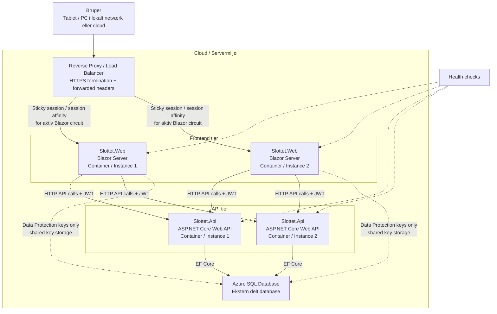

# Deployment Diagram

Dette diagram viser den nuværende deployment-arkitektur for Slottet og den produktionsretning, løsningen er designet til.

## Formål

Diagrammet skal vise:

- at løsningen er et distribueret client-server system
- at frontend og API er separate deploybare enheder
- at databasen er ekstern
- at løsningen kan køre både lokalt og i cloud
- at API er egnet til horisontal skalering
- at frontend med Blazor Server kræver sticky sessions/session affinity ved load balancing

## Mermaid-diagram

```mermaid
flowchart TB
    user["Bruger<br/>Tablet / PC i lokalt netværk eller cloud"] --> lb

    subgraph cloud["Cloud / Servermiljø"]
        lb["Reverse Proxy / Load Balancer<br/>HTTPS termination + forwarded headers"]

        subgraph webtier["Frontend tier"]
            web1["Slottet.Web<br/>Blazor Server<br/>Container / Instance 1"]
            web2["Slottet.Web<br/>Blazor Server<br/>Container / Instance 2"]
        end

        subgraph apitier["API tier"]
            api1["Slottet.Api<br/>ASP.NET Core Web API<br/>Container / Instance 1"]
            api2["Slottet.Api<br/>ASP.NET Core Web API<br/>Container / Instance 2"]
        end

        sql["Azure SQL Database<br/>Ekstern delt database"]
    end

    lb -->|"Sticky session / session affinity<br/>for aktiv Blazor circuit"| web1
    lb -->|"Sticky session / session affinity<br/>for aktiv Blazor circuit"| web2

    web1 -->|"HTTP API calls + JWT"| api1
    web1 -->|"HTTP API calls + JWT"| api2
    web2 -->|"HTTP API calls + JWT"| api1
    web2 -->|"HTTP API calls + JWT"| api2

    api1 -->|"EF Core"| sql
    api2 -->|"EF Core"| sql

    web1 -.->|"Data Protection keys only<br/>shared key storage"| sql
    web2 -.->|"Data Protection keys only<br/>shared key storage"| sql

    hc["Health checks"] -.-> web1
    hc -.-> web2
    hc -.-> api1
    hc -.-> api2
```

## Forklaring

Deployment-diagrammet viser, hvordan systemet er tænkt placeret i et produktionsmiljø. Brugeren tilgår systemet gennem en browser på tablet eller PC, hvorefter trafikken går gennem en reverse proxy eller load balancer. Herfra sendes brugeren videre til frontend-laget, som består af en eller flere instanser af `Slottet.Web`. Frontenden kalder derefter `Slottet.Api` over HTTP med JWT-baseret autentifikation, og API'et står for den egentlige adgang til domænedata i databasen.

Arkitekturen følger derfor i hovedtræk en klassisk opdeling mellem frontend, API og database, hvor API'et fungerer som systemets centrale adgangslag til data. API'et kan skaleres horisontalt, fordi flere API-instanser kan dele den samme eksterne database uden at være afhængige af lokal servertilstand.

### Frontend

- Frontenden er `Slottet.Web`
- den kører som Blazor Server
- den kan deployes i flere instanser
- den kommunikerer med API'et via HTTP
- den bruger JWT fra login-flowet til kald mod API'et

Relevante filer:

- `src/Slottet.Web/Program.cs`
- `src/Slottet.Web/Auth/AuthService.cs`
- `src/Slottet.Web/Auth/BrowserSessionAuthStore.cs`

### API

- API'et er `Slottet.Api`
- det eksponerer systemets funktioner som eksternt API
- det er den mest oplagte service at skalere horisontalt
- det bruger EF Core mod SQL Server

Relevante filer:

- `src/Slottet.Api/Program.cs`
- `src/Slottet.Api/Controllers`
- `src/Slottet.Infrastructure/Data/ApplicationDbContext.cs`

### Database

- databasen er ekstern Azure SQL
- den bruges til domænedata
- den bruges også til delte Data Protection keys
- Data Protection keys bruges kun som framework-infrastruktur i frontend og ikke til domænedata

Det er værd at bemærke, at frontenden i diagrammet har en stiplet forbindelse til databasen. Normalt bør en frontend ikke kende til eller have direkte forbindelse til databasen, fordi det bryder den rene lagdeling mellem frontend, API og datalag. I vores løsning er forbindelsen dog bevidst afgrænset til ASP.NET Core Data Protection keys og ikke til almindelige domænedata.

Grunden til dette valg er, at `Slottet.Web` kører som Blazor Server. Ved horisontal skalering kan flere frontend-instanser håndtere brugere bag en load balancer, og de instanser skal kunne dele de samme krypteringsnøgler. Ellers kan en instans få problemer med at læse cookies, tokens eller anden beskyttet framework-state, som er oprettet af en anden instans. Den delte key storage i databasen er derfor et praktisk infrastrukturvalg, der understøtter skalering, selvom vi er bevidste om, at forbindelsen fra frontend til database er et arkitektonisk kompromis.

Relevante filer:

- `src/Slottet.Infrastructure/Data/ApplicationDbContext.cs`
- `src/Slottet.Infrastructure/Data/Migrations/20260413120000_AddDataProtectionKeys.cs`

### Load balancer / reverse proxy

- i produktion antages løsningen at køre bag reverse proxy eller load balancer
- forwarded headers bruges for korrekt håndtering af klient-IP og HTTPS scheme
- Blazor Server kræver sticky sessions/session affinity for aktiv circuit

Relevante filer:

- `src/Slottet.Web/Program.cs`
- `src/Slottet.Api/Program.cs`
- `docker-compose.prod.yml`

### Health checks

- både frontend og API har `/health`
- health checks bruges til at afgøre om en service er klar og ikke kun startet

Relevante filer:

- `src/Slottet.Web/Program.cs`
- `src/Slottet.Api/Program.cs`
- `docker-compose.yml`

## Hvordan diagrammet kan forklares til eksamen

En mulig formulering:

“Deployment-diagrammet viser, at løsningen er et distribueret client-server system. Frontend og API er separate deploybare services, og databasen er ekstern i Azure SQL. API'et er velegnet til horisontal skalering, mens frontenden er Blazor Server og derfor kræver session affinity ved load balancing. Løsningen er derfor cloud-ready i sin arkitektur, men den konkrete højtilgængelighedsopsætning afhænger af den valgte platform, fx Azure.”

## Lokalt versus produktion

Lokalt i development:

- `docker-compose.yml` starter typisk én frontend og én API
- Swagger er aktiveret
- reverse proxy er ikke nødvendig

I produktionsretningen:

- flere instanser af API kan køre bag load balancer
- frontend kan også køres i flere instanser, men kræver sticky sessions
- Swagger er som udgangspunkt slået fra
- reverse proxy og forwarded headers er relevante
